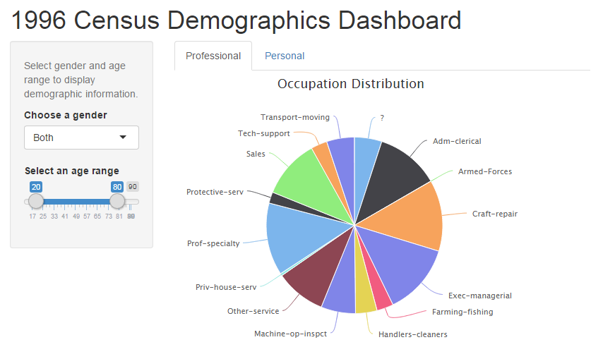
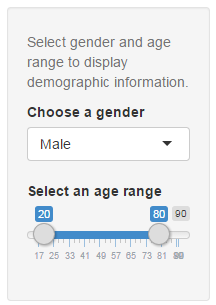
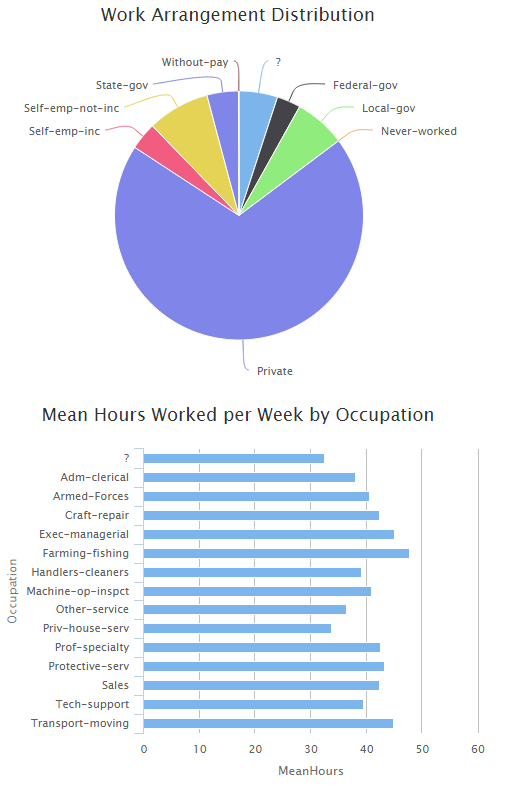
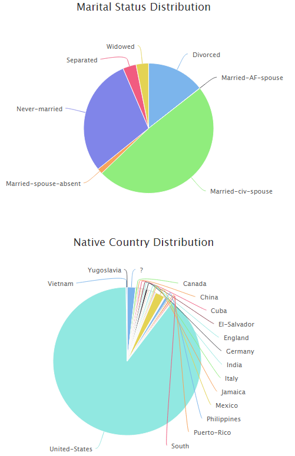

Census Dashboard Concept
========================================================
author: Jonathan Brant
date: April 16, 2015
transition: linear

<a href='https://jbrant.shinyapps.io/1996CensusApp/'>Census Dashboard Application</a>

Introduction
========================================================

The 1996 Census Demographics dashboard provides insight into several common descriptors of census respondents, including professional and personal characterizations.  The hope is to allow users to get a general idea of how said descriptors over gender and age.  A screenshot of the dashboard is shown below (note the left-hand controls and the tabbed content area).

Dashboard Controls
========================================================
left: 70%

On the left-hand side of the dashboard, two controls are provided to filter the visualizations by gender and age range.  All charts automatically update with the selected gender and minimum/maximum age, allowing the user to quickly see how their selections affect the characteristic distributions.

The age range slide accepts a lower-bound and upper-bound age.  The minimum age available is 20 years and the maximum age is 90 years.

Gender selection options include the following:

- Male
- Female
- Both (data is unfiltered with regards to sex)

***

Professional Metrics
========================================================
left: 60%

The tab titled "Professional" contains key occupation and salary distributions.  Specifically, the following metrics are provided:

- Occupation Distribution - relative distribution of occupations
- Work Arrangement Distribution - relative distribution of employment arrangements (e.g. self-employed, employed by corporation, etc.)
- Mean Hours Worked per Week by Occupation - average (arithmetic mean) number of hours worked per week
- Maximum Educational Attainment - count of people that topped out at the given education level

***

Personal Metrics
========================================================
left: 60%

The tab titled "Personal" contains key non-professional/education related metrics, such as marital status and ethnic distributions.  Specifically, the following metrics are provided:

- Marital Status Distribution - relative distribution of relationship statuses for the selected gender and age range (this isn't just a binary indicator, but also includes widowed, separated, etc.)
- Native Country Distribution - relative distribution of people born in a given country
- Race Distribution - relative distribution of race/ethnicity

***

